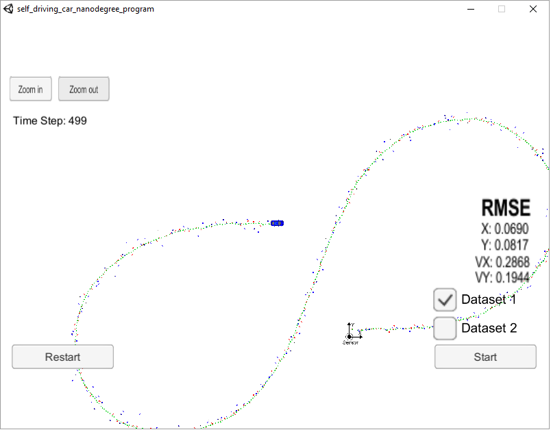
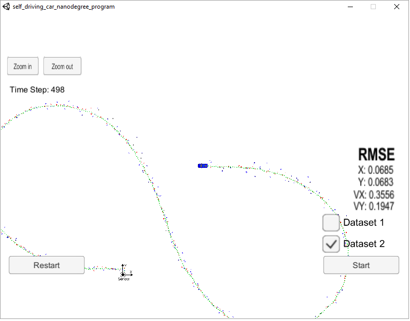

# Unscented Kalman Filter

Author : Manoj Kumar Subramanian

------

## Overview

This repository is as part of my Submission to the Project 2: Unscented Kalman Filter Project for the Udacity Self Driving Car Nano Degree Program Term 2.

In this project,  an unscented kalman filter is realized in C++ to estimate the state of a moving object of interest with noisy LIDAR and RADAR measurements. This project involves the Term 2 Simulator.

------

## Project Goals

The goals of this project are the following:

- The code must compile without any errors with cmake and make
- The project requires obtaining Root Mean Squared Error (RMSE) values for the estimated state variables to be lower than that the tolerance outlined in the project rubric [.09, .10, 0.40, 0.30].

------

## Rubric Points

### Compiling without any errors

I have used Docker for Windows using the DockerToolbox setup and pulled the Udacity's Carnd control kit docker container which constituted the necessary tools required (including cmake, make, gcc & git) for the project.

**<u>Basic Build Instructions</u>**

1. Clone this repo.

2. Make a build directory: `mkdir build && cd build`

3. Compile: `cmake .. && make` 

   - On windows, you may need to run: `cmake .. -G "Unix Makefiles" && make`

4. Run it: `./UnscentedKF` 

   The program should wait listening to port 4567.

**<u>Running the simulator</u>**

Before running the simulator, configure the port forwarding to the port 4567 since the simulator and the c++ program talk using the uWebSocketIO in port 4567.

INPUT: values provided by the simulator to the UnscentedKF c++ program

* ["sensor_measurement"] => the measurement that the simulator observed (either lidar or radar)

OUTPUT: values provided by the UnscentedKF c++ program to the simulator

* ["estimate_x"] <= kalman filter estimated position x
* ["estimate_y"] <= kalman filter estimated position y
* ["rmse_x"]
* ["rmse_y"]
* ["rmse_vx"]
* ["rmse_vy"]

In the simulator, choose the Project 1/2: EKF and UKF, select the respective dataset and press Start button. The simulator sends the Input to the UnscentedKF c++ program and gets the estimated and rmse values from the program that is visualized in the simulator.

---

### Accuracy of the Estimation

Below are the screenshots of the program executed for the Datasets 1 and 2.

It shall be noted that the RSME values are below the project requirements of [.09, .10, 0.40, 0.30].

**Dataset1:**

**Dataset2:**

------

### Correctness of Algorithm

**1. General Process flow:**

Since the startup code was already available from the Udacity's repository, the portions, where the TODO items were mentioned, were updated.

The functions for Predict, UpdateLidar and UpdateRadar are implemented in the ukf.cpp with the steps defined in the lectures. The tools.cpp file updated with the calculations for RSME.

In the initialization step of ukf.cpp, the noise factors were added.

**2. First Measurements:**

The item for the first initialization measurements to update the necessary state variables and the co-variance matrix were added. As per the dataset available, the RADAR co-ordinates function to switch between polar to cartesian is added.

**3. Predict and Update:**

For the next measurements, updating the time interval, calling the predict function was implemented. For the update, the methods UpdateLidar and UpdateRadar created in ukf.cpp were used.

**4. Separating LIDAR and RADAR:**

For the updating, since the RADAR measurements were having 3 measurement units and co-ordinates switching between polar and cartesian, the filters UpdateRadar method was used to get the estimated state variables.

For the LIDAR, the Kalman filters UpdateLidar method used to update based on 2 measurement units.

**General considerations:**

As mentioned in the project tips, code sections to avoid divide by zero and maintaining the calculated phi angle within the -pi to +pi range were added.

*<u>NIS Calculations</u>*

As mentioned in the lectures, NIS calculations were performed for RADAR and LIDAR separately to identify the deviations on the process noises and tune the same to match to meet the requirements.

